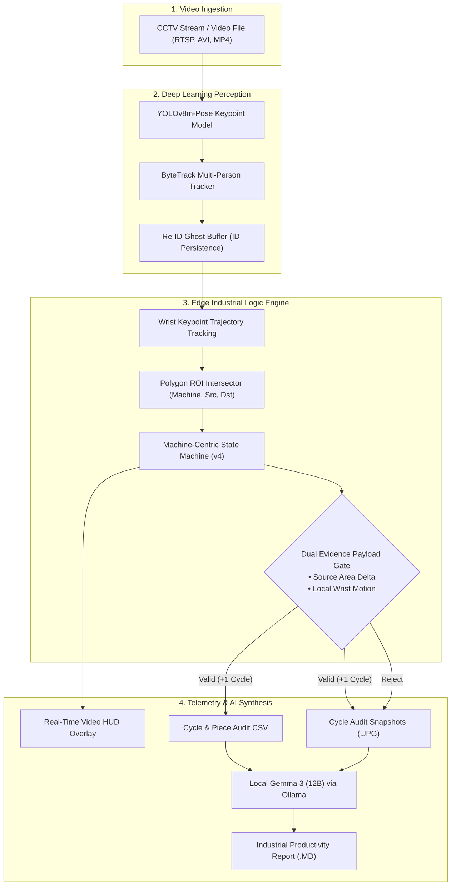

<div align="center">

# 🧵 VisionCraft: Industrial Sewing & Workstation Production Intelligence

### Real-Time Worker Pose Estimation • Machine-Centric Piece-Work Counting • Local Multimodal AI Auditing

[](https://www.python.org/)
[](https://github.com/ultralytics/ultralytics)
[](https://opencv.org/)
[](https://ollama.com/library/gemma3)
[](LICENSE)

<p align="center">
  <b>A production-grade Edge AI system transforming standard CCTV video into actionable industrial engineering telemetry, automated piece-work audit trails, and executive Kaizen reports.</b>
</p>

</div>

---

## 📑 Table of Contents
- [Executive Overview](#-executive-overview)
- [System Architecture](#-system-architecture)
- [Core Innovation & Algorithms](#-core-innovation--algorithms)
  - [1. Machine-Centric Finite State Machine](#1-machine-centric-finite-state-machine)
  - [2. Dual-Evidence Fabric Payload Gate](#2-dual-evidence-fabric-payload-gate)
  - [3. Worker Re-ID Ghost Buffer](#3-worker-re-id-ghost-buffer)
  - [4. Edge Safety & Ergonomics Monitoring](#4-edge-safety--ergonomics-monitoring)
- [Local Multimodal AI: Gemma 3 Integration](#-local-multimodal-ai-gemma-3-integration)
- [Directory Layout](#-directory-layout)
- [Hardware & Software Prerequisites](#-hardware--software-prerequisites)
- [Quick Start Guide](#-quick-start-guide)
- [Interactive Calibration & Keyboard Shortcuts](#-interactive-calibration--keyboard-shortcuts)
- [Output Artifacts & Sample Telemetry](#-output-artifacts--sample-telemetry)
- [Configuration Options](#-configuration-options)
- [License](#-license)

---


## 🎯 Executive Overview

In textile manufacturing, accurate piece-rate counting and operator efficiency metrics often rely on manual tallies or intrusive hardware sensors that frequently break down.

**VisionCraft** introduces an intelligent, non-invasive computer-vision pipeline powered by **YOLOv8-pose keypoint estimation**, **ByteTrack spatial-temporal tracking**, a **state-machine piece counter with optical payload validation**, and **Google Gemma 3 (12B)** running locally via Ollama.

### 🌟 Key Highlights
- **Zero Sensor Footprint**: Works with existing overhead CCTV cameras (RTSP / local recordings).
- **Zero Gaming / Anti-False-Positive**: Requires real fabric displacement between source and destination zones; empty hand movements are rejected.
- **Machine-Centric Stability**: State transitions remain locked to the physical machine, even during operator handoffs or tracker ID occlusions.
- **Automated Industrial Engineering (IE) Audits**: Produces comprehensive line balancing, utilization rate, and bottleneck analysis reports automatically.

---

## 🏗️ System Architecture



---

## 🔬 Core Innovation & Algorithms

### 1. Machine-Centric Finite State Machine
Traditional vision counters tie cycles to person IDs, causing severe inaccuracies when multiple operators handle a single station or during camera occlusions. This system anchors state transitions strictly to the machine's configured ROIs:

$$\mathbf{IDLE} \xrightarrow[\text{wrist in Source}]{\Delta t \ge t_{\text{dwell}}} \mathbf{HAND\_IN\_SRC} \xrightarrow[\text{wrist leaves Source}]{\text{motion detected}} \mathbf{IN\_TRANSIT} \xrightarrow[\text{wrist in Destination}]{\Delta t \ge t_{\text{dwell}}} \mathbf{HAND\_IN\_DST} \xrightarrow[\text{gate verified}]{\text{cycle committed}} \mathbf{COOLDOWN} \rightarrow \mathbf{IDLE}$$

```text
 [ IDLE ] ──(Dwell in Source ≥ 0.3s)──► [ HAND_IN_SRC ]
                                              │
                                      (Transit begins)
                                              ▼
 [ COOLDOWN ] ◄──(Payload Gate PASS)─── [ HAND_IN_DST ] ◄──(In Transit ≤ 6.0s)─── [ IN_TRANSIT ]
      │                                       │
      │                                (Payload Gate FAIL)
      │                                       ▼
      └────────────────────────────────► [ REJECT AUDIT ] ──► [ IDLE ]
```

### 2. Dual-Evidence Fabric Payload Gate
To prevent workers or passersby from triggering counts with empty hands, the system enforces a dual-evidence payload test:
1. **Source-Area Pixel Difference**: Compares pre-pickup and post-pickup grayscale variance in the material bin to confirm physical fabric extraction.
2. **Wrist Temporal Motion Gradient**: Measures optical velocity vectors around the active wrist crop throughout the transit phase.

### 3. Worker Re-ID Ghost Buffer
When workers bend, face backwards, or walk behind machines, tracker IDs typically swap. The **Ghost Buffer** preserves spatial coordinates, velocity vectors, and keypoint envelopes for $3.0\text{ seconds}$, mapping reassigned raw IDs seamlessly back to canonical IDs.

### 4. Edge Safety & Ergonomics Monitoring
- **Crowding Alerts**: Triggers real-time alerts when $>1$ person enters a single machine envelope.
- **Idleness Thresholds**: Flags operators remaining stationary without productive hand movements for $>10\text{ seconds}$.

---

## 🧠 Local Multimodal AI: Gemma 3 Integration

At the end of a shift or observation session, accumulated telemetry data and critical visual audit frames are automatically dispatched to a local **Google Gemma 3 (12B)** instance running over Ollama.

```text
═════════════════════════════════════════════════════════════════
  SENDING VIDEO TELEMETRY TO GEMMA 3 (gemma3:12b)
  Generating Machine Efficiency & Operator Productivity Report...
═════════════════════════════════════════════════════════════════
```

### Sample Automated Kaizen Evaluation
```markdown
# Workstation & Machine Efficiency Study

## Executive Summary
- Total Units Produced: 4 pieces across 3 machines
- Line Takt Time: 12.2s per piece
- Observation Window: 48.9s (32 unique tracks, 16 transient)

## Workstation Bottleneck Analysis
| Workstation | Active Time | Idle Time | Utilization Rate | Pieces |
| :--- | :--- | :--- | :--- | :--- |
| Machine-1 | 38.4s | 10.5s | 78.5% | 2 |
| Machine-2 | 41.2s | 7.7s  | 84.2% | 2 |
| Machine-3 | 4.1s  | 44.8s | 8.3%  | 0 (Bottleneck) |

### Kaizen Action Items:
1. Machine-3 experienced 2 transit timeouts (operator reached for fabric without dropoff).
2. Machine-2 suffered repeated crowding alerts (training intervention required).
```

---

## 📂 Directory Layout

```
├── person_tracker.py               # Main pipeline: inference loop, ByteTrack, alerts, and HUD
├── piece_counter.py                # Industrial piece-counting state machine & payload gate
├── gemma_analyzer.py               # Local Ollama / Gemma 3 multimodal reporter
├── zones_config.json               # Pre-configured bounding boxes for machines, sources, and destinations
├── requirements.txt                # Production Python dependencies
├── run_person_tracker.sh           # One-click Linux launch script
├── run_person_tracker.bat          # One-click Windows launch script
├── roi_canvas_component/           # Web-based interactive ROI calibration tool
├── piece_audit_snapshots/          # Automatic captures of valid and rejected cycles
└── .gitignore                      # Configured to ignore raw CCTV videos and large .pt checkpoints
```

---

## ⚡ Hardware & Software Prerequisites

| Component | Minimum | Recommended |
| :--- | :--- | :--- |
| **OS** | Ubuntu 20.04+ / Windows 10+ | Ubuntu 22.04 / 24.04 LTS |
| **Python** | 3.10 | 3.11 or 3.12 |
| **GPU** | NVIDIA GTX 1660 (6GB) | NVIDIA RTX 3060 / 4070 (8GB+ VRAM) |
| **Inference FPS** | ~13-15 FPS (YOLOv8m-pose) | ~30-45 FPS (TensorRT optimized) |
| **Ollama (Optional)** | 16GB System RAM | 32GB RAM / 12GB VRAM for `gemma3:12b` |

---

## 🚀 Quick Start Guide

### 1. Clone & Set Up Environment

```bash
# Clone the repository
git clone https://github.com/Jeevamoorthy/VisionCraft.git
cd VisionCraft

# Create a virtual environment
python3 -m venv .venv
source .venv/bin/activate       # Windows: .venv\Scripts\activate

# Install required dependencies
pip install -r requirements.txt
```

### 2. Prepare Weights

The system uses `yolov8m-pose.pt`. It will download automatically on first run, or you can fetch it manually:

```bash
wget https://github.com/ultralytics/assets/releases/download/v8.2.0/yolov8m-pose.pt
```

### 3. Launch Video Pipeline
 
```bash
# Run with the default factory 1080p benchmark footage:
python person_tracker.py --video "person video/Workers_operating_sewing_machines_1080p_20261008140921.mp4"

# Or run Linux / Windows one-click scripts:
./run_person_tracker.sh          # Linux
run_person_tracker.bat           # Windows

# Run in headless mode (server / edge deployment)
python person_tracker.py --video "rtsp://camera-ip/live" --no-show
```

---

## 🎛️ Interactive Calibration & Keyboard Shortcuts

If `zones_config.json` does not exist or you want to calibrate a new camera angle:

| Phase | Action | Key / Input |
| :--- | :--- | :--- |
| **Machine Zones** | Draw machine envelope | **Left Click & Drag** |
| | Delete last drawn zone | <kbd>D</kbd> |
| | Clear all zones | <kbd>C</kbd> |
| | Save and proceed to bins | <kbd>Enter</kbd> / <kbd>S</kbd> |
| **Source / Destination Bins** | Draw Source container | **Left Click & Drag** (Yellow Box) |
| | Draw Destination container | **Left Click & Drag** (Cyan Box) |
| | Confirm box and advance | <kbd>Enter</kbd> / <kbd>S</kbd> |
| **Tracking Run** | Pause / Quit processing | <kbd>Q</kbd> / <kbd>Esc</kbd> |

---

## 📊 Output Artifacts & Sample Telemetry

Each execution automatically processes the input footage and generates comprehensive audit assets:

- **Source Footage (`person video/`)**:
  - `Workers_operating_sewing_machines_1080p_20261008140921.mp4` — High-definition 1080p factory video feed capturing multiple sewing machine stations.
- **Annotated HUD Video**:
  - `Workers_operating_sewing_machines_1080p_20261008140921_tracked.avi` — Overlaid with active pose skeletons, machine boundaries, wrist trajectories, and real-time alert logs.
- **Piece Audit Telemetry** (`*_tracked_pieces.csv`):
  ```csv
  timestamp,frame,machine,operator_id,cycle_number,transit_time_sec,confidence,payload_score,status
  00:18.2,462,Machine-2,ID:2,1,0.36,0.84,0.85,CONFIRMED
  00:37.8,963,Machine-1,ID:6,2,0.36,0.87,0.85,CONFIRMED
  ```
- **Audit Snapshots** (`piece_audit_snapshots/`):
  - High-resolution frame crops for every cycle (both confirmed cycles and payload rejections).
- **Gemma 3 Markdown Report** (`*_tracked_gemma_efficiency_report.md`):
  - Formatted industrial engineering summary ready for production managers.

---

## ⚙️ Configuration Options

Parameters can be tuned via CLI flags:

```bash
python person_tracker.py \
  --video "footage.mp4" \
  --conf 0.25 \
  --ghost-sec 3.0 \
  --idle-sec 10.0 \
  --zones-json "zones_config.json"
```

| Flag | Default | Description |
| :--- | :--- | :--- |
| `--video` | *(Default test video)* | Video source path or camera index |
| `--conf` | `0.25` | Minimum pose detection confidence score |
| `--ghost-sec` | `3.0` | Re-ID window to reclaim transient lost IDs |
| `--idle-sec` | `10.0` | Duration before flagging operator as idle |
| `--no-show` | `False` | Disables OpenCV GUI display window |
| `--zones-json`| `zones_config.json` | Path to load/persist zone configurations |

---

## 📄 License

Distributed under the **MIT License**. See `LICENSE` for details.

---

<div align="center">
  <b>Developed by Jeeva M I</b><br>
  <i>Empowering Manufacturing with Computer Vision & Edge AI</i>
</div>
